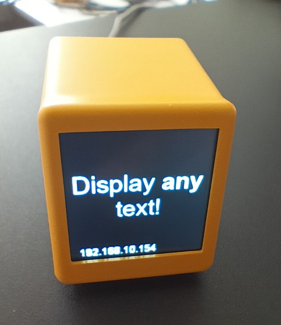

# Smart Weather Clock Display Tool

A Python tool for generating and uploading images with text to a small 240x240 display device. Features intelligent auto-sizing, extensive customization options, and enhanced text rendering for optimal clarity.

**Compatible with**: [Smart Weather Clock Display Device](https://aliexpress.com/item/1005008985614049.html)



Offical Link from purchased product:

[Smart Weather Clock](https://bit.ly/smwec)

## Features

- **🔤 Smart Text Rendering**: Auto font sizing with enhanced clarity for colored text
- **🎨 Extensive Color Support**: 18 named colors + hex/RGB + predefined schemes
- **📐 Advanced Text Layout**: Left, center, right, and justify alignment with custom padding
- **✨ Text Enhancement**: Optional stroke/outline + HTML formatting (bold, italic, underline)
- **🏷️ HTML Support**: Auto-detected formatting with `<b>`, `<i>`, and `<u>` tags
- **🌈 Gradient Backgrounds**: Smooth color transitions with custom directions
- **📁 File Upload Support**: Upload existing images to any display slot
- **🔧 Modular Architecture**: Clean, extensible codebase with dedicated classes
- **⚙️ Flexible CLI**: Intuitive command structure with legacy compatibility

## Installation

1. Clone the repository:
```bash
git clone https://github.com/your-username/smart-weather-clock.git
cd smart-weather-clock
```

2. Install dependencies:
```bash
install.bat
```

## Usage

### New Command Format (Recommended)

```bash
# Basic text display with auto-sizing (default)
python main.py --text "Hello World"

# Specify slot and font size
python main.py --slot 2 --text "Big Text" --font-size 48

# Custom text color
python main.py --text "Red Text" --font-color red
python main.py --text "Custom Color" --font-color "#FF5733"
python main.py --text "RGB Color" --font-color "128,255,0"

# Enable stroke for better clarity on colored text
python main.py --text "Blue Text" --font-color blue --text-stroke
python main.py --text "Custom Stroke" --font-color red --stroke-width 2

# Upload image file
python main.py --file image.jpg --slot 3

# Complete example
python main.py --text "<b>Bold</b> <i>Text</i>"  --font-size auto --color-scheme default --text-align justify --font-color red --stroke-color white --stroke-width 2
```

### Legacy Format (Still Supported)

```bash
# Legacy text mode
python main.py 1 text "Hello World"

# Legacy file mode
python main.py 2 dummy_2.jpg
```

### Color Options

```bash
# Predefined color schemes (background + text color)
python main.py --text "Blue Theme" --color-scheme blue

# Custom text colors (18 named colors available)
python main.py --text "Red Text" --font-color red
python main.py --text "Yellow Text" --font-color yellow
python main.py --text "Cyan Text" --font-color cyan

# Available named colors:
# white, black, red, green, blue, yellow, cyan, magenta, orange,
# purple, pink, lime, navy, gray, silver, brown, gold, turquoise

# Hex colors
python main.py --text "Hex Color" --font-color "#FF5733"

# RGB format
python main.py --text "RGB" --font-color "255,128,0"

# Available schemes: default, blue, green, red, light, purple
```

### Gradient Backgrounds

```bash
# Create gradient background
python main.py --text "Gradient" --gradient --gradient-end "#ff0000"

# With custom text color
python main.py --text "Gradient" --gradient --gradient-end "blue" --font-color yellow
```

### Text Alignment

```bash
# Left align
python main.py --text "Left Text" --text-align left

# Center (default)
python main.py --text "Center Text" --text-align center

# Right align
python main.py --text "Right Text" --text-align right

# Justified (spreads text evenly across width)
python main.py --text "This is a longer text that will be justified across the full width of the display" --text-align justify
```

### Padding Configuration

```bash
# Individual padding control
python main.py --text "Custom Padding" --padding-bottom 40 --padding-top 10

# Set all paddings at once
python main.py --text "Uniform Padding" --padding 20

# Mix individual and uniform
python main.py --text "Mixed" --padding 15 --padding-bottom 35

# Default: top=0, bottom=25, left=0, right=0 (space for IP display)
```

### File Upload

```bash
# Upload existing image
python main.py --file path/to/image.jpg --slot 1

# Legacy mode (backward compatible)
python main.py 1 dummy_1.jpg
```

### Advanced Options

```bash
# Save locally before uploading
python main.py --text "Save Local" --save-local

# Custom display URL
python main.py --text "Custom URL" --base-url http://192.168.1.100

# Combine multiple options
python main.py --text "Advanced" \
  --font-size auto \
  --font-color gold \
  --gradient --gradient-end "#00ff00" \
  --padding-bottom 30 \
  --save-local
```

## Complete Command Reference

### 🎯 Core Arguments

| Argument | Type | Default | Description |
|----------|------|---------|-------------|
| `--text` | string | - | Text to display (required if no --file) |
| `--file` | path | - | Image file to upload (alternative to --text) |
| `--slot` | 1-5 | 1 | Display slot number |

### 🎨 Text Appearance

| Argument | Type | Default | Options/Format |
|----------|------|---------|----------------|
| `--font-size` | string/int | auto | Number (10-200) or "auto" |
| `--font-color` | string | white | Named color, #hex, or r,g,b |
| `--color-scheme` | string | default | default, blue, green, red, light, purple |
| `--text-align` | string | center | left, center, right, justify |

### ✨ Text Enhancement

| Argument | Type | Default | Description |
|----------|------|---------|-------------|
| `--text-stroke` | flag | false | Enable text stroke/outline |
| `--stroke-width` | int | 0 | Stroke width in pixels (1-5) |
| `--stroke-color` | string | auto | Stroke color (auto-contrasting) |
| `--no-auto-stroke` | flag | false | Disable auto-stroke when other stroke options set |
| `--html` | flag | false | Force HTML formatting (auto-detected when tags present) |

### 📐 Layout & Spacing

| Argument | Type | Default | Description |
|----------|------|---------|-------------|
| `--padding` | int | - | Set all paddings at once |
| `--padding-top` | int | 0 | Top padding in pixels |
| `--padding-bottom` | int | 25 | Bottom padding (space for IP display) |
| `--padding-left` | int | 0 | Left padding in pixels |
| `--padding-right` | int | 0 | Right padding in pixels |

### 🌈 Visual Effects

| Argument | Type | Default | Description |
|----------|------|---------|-------------|
| `--gradient` | flag | false | Enable gradient background |
| `--gradient-end` | string | - | End color for gradient |

### ⚙️ System Options

| Argument | Type | Default | Description |
|----------|------|---------|-------------|
| `--save-local` | flag | false | Save generated image locally |
| `--base-url` | url | http://192.168.10.154 | Display device URL |

### 📋 Named Colors (18 Available)

| Color Names | | | |
|-------------|---|---|---|
| `white` `black` `gray` `silver` | `red` `green` `blue` `yellow` | `cyan` `magenta` `orange` `purple` | `pink` `lime` `navy` `brown` |
| **Special:** `gold` `turquoise` | | | |

## 📚 Usage Examples by Category

### 🚀 Quick Start
```bash
# Simplest usage (auto-sized text on slot 1)
python main.py --text "Hello World"

# Different slots
python main.py --text "Slot 2" --slot 2
```

### 🎨 Colors & Styling
```bash
# Named colors
python main.py --text "Red Alert" --font-color red
python main.py --text "Gold Rush" --font-color gold

# Hex colors
python main.py --text "Custom Blue" --font-color "#1E90FF"

# RGB colors  
python main.py --text "RGB Purple" --font-color "128,0,128"

# Color schemes (background + text)
python main.py --text "Blue Theme" --color-scheme blue
```

### 📏 Font Sizes
```bash
# Auto-sizing (default)
python main.py --text "Auto sized to fit perfectly"

# Fixed sizes
python main.py --text "Small" --font-size 16
python main.py --text "Large" --font-size 64
```

### 📐 Text Alignment
```bash
# Alignment options
python main.py --text "Left aligned" --text-align left
python main.py --text "Centered" --text-align center
python main.py --text "Right aligned" --text-align right

# Justified (distributes words evenly)
python main.py --text "This text is justified across the full width" --text-align justify
```

### ✨ Text Enhancement
```bash
# Enable stroke for colored text clarity
python main.py --text "Blue Stroke" --font-color blue --text-stroke

# Custom stroke width
python main.py --text "Bold Outline" --font-color red --stroke-width 3

# Custom stroke color
python main.py --text "Yellow Text" --font-color yellow --stroke-color black
```

### 🏷️ HTML Formatting (Auto-Detected)
```bash
# Bold text (HTML auto-detected)
python main.py --text "<b>XIDA.me</b> offline!"

# Italic text (HTML auto-detected)
python main.py --text "Welcome to <i>Smart Display</i>"

# Underlined text (HTML auto-detected)
python main.py --text "<u>Important Notice</u>"

# Combined formatting (HTML auto-detected)
python main.py --text "<b>Bold</b> and <i>italic</i> and <u>underline</u>"

# Nested formatting (HTML auto-detected)
python main.py --text "<b><i>Bold Italic</i></b> text"

# Mixed with colors and stroke (HTML auto-detected)
python main.py --text "<b>Bold Red</b> normal text" --font-color red --text-stroke

# Force HTML mode (optional, for edge cases)
python main.py --text "Plain text" --html
```

### 📐 Custom Padding
```bash
# Account for IP display at bottom
python main.py --text "Standard" --padding-bottom 30

# Custom padding for each side
python main.py --text "Custom Layout" --padding-top 5 --padding-bottom 40 --padding-left 15

# Uniform padding
python main.py --text "Equal Spacing" --padding 20
```

### 🌈 Gradients
```bash
# Vertical gradient (default)
python main.py --text "Gradient Text" --gradient --gradient-end "#FF6B6B"

# With colored text
python main.py --text "Colorful" --gradient --gradient-end "blue" --font-color white --text-stroke
```

### 📁 File Operations
```bash
# Upload image file
python main.py --file photo.jpg --slot 3

# Save generated image locally
python main.py --text "Save Me" --save-local

# Custom device URL
python main.py --text "Remote Display" --base-url "http://192.168.1.100"
```

### 🔧 Advanced Combinations
```bash
# Everything together
python main.py \
  --text "Advanced Example" \
  --slot 2 \
  --font-color gold \
  --text-align center \
  --stroke-width 2 \
  --stroke-color black \
  --gradient \
  --gradient-end "#8B4513" \
  --padding-bottom 35 \
  --save-local

# HTML formatting with all features (auto-detected)
python main.py \
  --text "<b>XIDA.me</b> <i>Smart Display</i>" \
  --font-color cyan \
  --text-stroke \
  --gradient \
  --gradient-end navy \
  --text-align center \
  --padding-bottom 30
```

## 🏗️ Project Structure

```
smart-weather-clock/
├── main.py              # Main CLI interface with argument parsing
├── image_generator.py   # ImageGenerator class with text rendering
├── display_uploader.py  # DisplayUploader class for device communication  
├── config.py           # Configuration constants and color definitions
├── utils.py            # Utility functions for color parsing and text processing
├── requirements.txt    # Python dependencies (Pillow, requests)
└── README.md          # This comprehensive documentation
```

## Classes

### ImageGenerator
- Creates 240x240 images with text
- Supports auto font sizing
- Handles text wrapping
- Creates gradient backgrounds

### DisplayUploader
- Uploads images to display device
- Handles image processing and conversion
- Supports batch uploads
- Tests device connectivity

### Configuration
- Display settings (size, URL, slots)
- Image settings (colors, fonts, padding)
- Auto-size parameters

## Key Features Explained

### Auto Font Size

The auto font size feature (default) intelligently adjusts text size:

- **Algorithm**: Binary search between 10-200px
- **Smart Padding**: Accounts for IP display at bottom (25px)
- **Precision**: Optimized for quick calculation
- **Usage**: Default behavior, or explicitly with `--font-size auto`

```bash
# Auto is the default
python main.py --text "Auto sized"

# Explicit auto
python main.py --text "BIG" --font-size auto
```

### Custom Padding for IP Display

The display shows an IP address at the bottom (~25-30px). Default padding accounts for this:

```bash
# Default leaves space for IP
python main.py --text "With IP space"

# Custom bottom padding
python main.py --text "More space" --padding-bottom 40

# No padding (text may overlap IP)
python main.py --text "Full screen" --padding 0
```

### Text Stroke Enhancement

**Problem Solved**: Colored fonts (red, blue, etc.) appeared pixelated compared to white text.

**Solution**: Optional stroke/outline for colored text:

- **Manual Activation**: Enable with `--text-stroke`, `--stroke-width`, or `--stroke-color`
- **Smart Colors**: Black stroke for bright colors, white stroke for dark colors  
- **Contrast Analysis**: Uses WCAG contrast ratios to determine optimal stroke
- **Disabled by Default**: No performance impact unless explicitly enabled

```bash
# Enable stroke for colored text (improves clarity)
python main.py --text "Blue Text" --font-color blue --text-stroke

# Custom stroke width
python main.py --text "Bold Text" --font-color yellow --stroke-width 2

# Custom stroke color  
python main.py --text "Custom" --font-color red --stroke-color white

# Setting any stroke option enables the feature
python main.py --text "Auto" --font-color green --stroke-color black
```

### Improved Line Spacing

Line spacing increased to 10px for better readability in multi-line text.

## Color Formats

Colors can be specified in multiple formats:
- Hex: `#RRGGBB` (e.g., `#ff0000` for red)
- RGB: `r,g,b` (e.g., `255,0,0` for red)
- Named schemes: Use predefined color schemes

## Display Slots

The display supports 5 slots (1-5). Each slot can contain a different image:

```bash
# Upload different content to each slot
python main.py --slot 1 --text "Slot 1"
python main.py --slot 2 --text "Slot 2" --font-color red
python main.py --slot 3 --text "Slot 3" --color-scheme blue
python main.py --slot 4 --file image.jpg
python main.py --slot 5 --text "Slot 5" --gradient --gradient-end cyan
```

## Requirements

- Python 3.6+
- Pillow 10.3.0
- requests 2.31.0

## Troubleshooting

### Font Size Not Changing
- The tool automatically detects system fonts (Arial on Windows)
- If fonts aren't found, it falls back to default (which doesn't support sizing)
- Check console output for font warnings

### Connection Issues
- Verify the display device IP address
- Use `--base-url` to specify custom URL
- Ensure device is on the same network

### Image Quality
- Images are automatically converted to 240x240 JPEG
- Quality is set to 70% for optimal file size
- Original images are center-cropped if not square

## License

[Your License Here]

## Contributing

[Contributing guidelines if applicable]